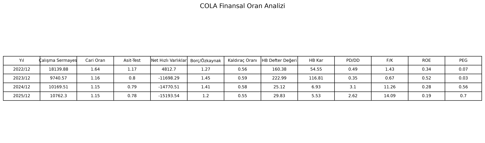

# Financial Ratio Analyzer

This project is a Python-based financial statement analysis tool.  
It reads company balance sheet data from Excel files and calculates key financial ratios for multiple years.

---

## Features

- Reads financial statement data from Excel files
- Calculates liquidity ratios
- Calculates leverage ratios
- Calculates profitability ratios
- Calculates market valuation ratios
- Exports results to Excel
- Saves result tables as PNG images

---

## Companies Used

The current version includes example analysis for:

- Coca-Cola İçecek (COLA)
- Ford Otosan (FROTO)

---

## Calculated Ratios

| Ratio | Formula |
|---|---|
| Working Capital | Current Assets - Current Liabilities |
| Current Ratio | Current Assets / Current Liabilities |
| Acid-Test Ratio | (Current Assets - Inventories - Prepaid Expenses) / Current Liabilities |
| Net Quick Assets | Quick Assets - Current Liabilities |
| Debt/Equity | Total Liabilities / Total Equity |
| Leverage Ratio | Total Liabilities / Total Assets |
| Book Value Per Share | Parent Equity / Paid-in Capital |
| Earnings Per Share | Net Income / Paid-in Capital |
| P/B | Stock Price / Book Value Per Share |
| P/E | Stock Price / Earnings Per Share |
| ROE | Net Income / Parent Equity |
| PEG | P/E / Growth Rate |

---

*Cola Stock Price: 78 TL*

*Growth Rate: %20*



---

## Project Structure

```text
financial-ratio-analyzer/
│
├── Data/
│   ├── COLA.xlsx
│   └── FORD.xlsx
│
├── Result/
│   ├── COLA_finansal_oran_tablosu.png
│   ├── FORD_finansal_oran_tablosu.png
│   └── finansal_oran_sonuclari.xlsx
│
├── src/
│   └── main.py
│
├── README.md
├── requirements.txt
└── .gitignore